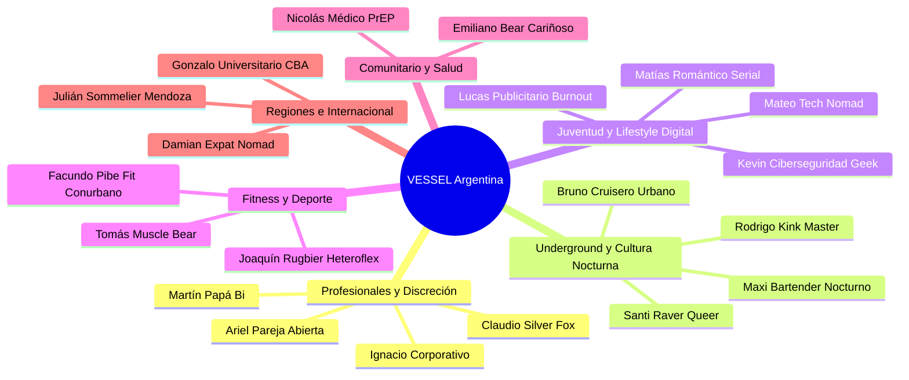

# Arquetipos de Usuario y Psicografía de Mercado — Sistema VESSEL (Lanzamiento Argentina)

Este documento define en profundidad los **20 arquetipos fundamentales de usuario ("Personas")** para el despliegue inicial de **VESSEL** en Argentina. Sirve como base empírica y psicológica para el diseño de producto, priorización del backlog, validación de flujos UX (Impeccable UI), telemetría háptica/acústica y modelos de monetización (`VESSEL UNLIMITED`).

---

## 🗺️ Mapa de Diversidad y Cobertura de Arquetipos

---

## 1. Mateo "El Dev Tech / Crypto Nomad" (29 años)

- **Ubicación**: Palermo Soho / Colegiales, CABA.
- **Identidad & Rol**: Gay / Versátil.
- **Perfil Sociodemográfico**: Desarrollador Senior Fullstack / Web3 trabajando remoto para el exterior. Nivel socioeconómico alto (ingresos en USD). Vive en un dos ambientes de diseño minimalista con balcón y plantas.
- **Hardware & Conectividad**:
  - iPhone 14 Pro / MacBook Pro M2.
  - Conexión 5G de Personal + Fibertel 500 Mbps con router Wi-Fi 6.
  - Apps habituales: Telegram, X (Twitter), Slack, Mercado Pago, Binance, Spotify, Notion.
  - Batería: Llega a las 20:00 hs con 25-30% de batería por uso intensivo de pantalla.
- **Gustos, Intereses & Salidas**:
  - Música: Melodic Techno, Synthwave, Indie Electrónico (Boiler Room, Cercle).
  - Boliches y Bares: Crobar, Under Club, café de especialidad (Cuervo, Lattente), vermuterías en Chacarita.
  - Hobbies: Crossfit matutino, armado de setups ergonómicos, podcasts de tecnología y finanzas.
- **Comportamiento Sexual & Citas**:
  - Busca dinamismo: sexo casual de calidad entre semana y posibles conexiones interesantes los fines de semana.
  - Valora la higiene, estética y puntualidad. Recibe en su departamento impecable.
- **Frustraciones con Apps Previas (Grindr/Tinder)**:
  - Odia la lentitud de Grindr, los anuncios intrusivos en video que congelan el celular y los perfiles con fotos borrosas.
  - Le frustran las conversaciones redundantes de 3 días que terminan en la nada ("hola, qué buscás").
- **Hooks con VESSEL**:
  - **Pre-Flight Checklist**: Acuerda en 3 taps las intenciones y prácticas antes de pasar la dirección.
  - **Diseño Dark Brutalist (Obsidian / Electric Violet)**: Sintoniza de inmediato con su estándar estético visual.
  - **Rendezvous PIN**: Envía una ubicación efímera cifrada para no dejar su dirección grabada eternamente en chats ajenos.
- **Insight de Producto / Mejora para VESSEL**:
  - Alta propensión a pagar `VESSEL UNLIMITED` por comodidad y exclusividad.
  - Demanda integración con atajos rápidos de teclado en web/desktop y telemetría fluida sin micro-stuttering.

---

## 2. Facundo "El Pibe Fit de Barrio" (24 años)

- **Ubicación**: Lanús Oeste / Lomas de Zamora, Gran Buenos Aires Sur (frecuenta CABA por estudio/gym).
- **Identidad & Rol**: Gay / Activo definido.
- **Perfil Sociodemográfico**: Entrenador en gimnasio de barrio y estudiante de Kinesiología (UNLa). Clase media trabajadora. Vive con su madre y hermano menor en casa de barrio.
- **Hardware & Conectividad**:
  - Motorola Moto G84 / Samsung Galaxy A54 (gama media Android).
  - Prepago mensual con datos limitados; viaja en el Tren Roca y subte C/H donde la señal suele oscilar.
  - Batería: Sale a las 07:00 hs y regresa a las 22:00 hs; cuida la batería obsesivamente.
- **Gustos, Intereses & Salidas**:
  - Música: Cumbia RKT, Trap argentino (Duki, YSY A), Reggaeton old school.
  - Salidas: Juntadas con amigos en cervecerías locales, asados de domingo, boliches de la zona sur o fiestas masivas tipo Plop! o Rheo cuando viene a Capital.
  - Hobbies: Fierros pesados, fútbol 5 con pibes del barrio, suplementación deportiva.
- **Comportamiento Sexual & Citas**:
  - 100% activo. Como no puede recibir en su casa familiar, viaja con frecuencia a CABA o busca quien tenga lugar cómodo ("hostea vos").
- **Frustraciones con Apps Previas**:
  - Apps que consumen 150 MB de datos en 10 minutos bajando publicidad innecesaria.
  - La geolocalización tradicional expone con exactitud su manzana en Lanús, generándole preocupación por seguridad y rumores barriales.
  - Gente que le dice que tiene lugar y cuando llega a la estación le cancelan o lo dejan plantado (ghosteo en viaje).
- **Hooks con VESSEL**:
  - **Google S2 Geohashing (~152m)**: Anti-triangulación que no regala su ubicación en el conurbano.
  - **BatteryStateEngine**: Ahorro reactivo de datos y batería cuando viaja en transporte público.
  - **Ficha de Hospedaje (Host Card) + Pre-Flight**: Claridad total sobre quién pone el lugar y comodidades antes de tomar el tren.
  - **Modo En Camino (En-Route)** con alerta acústica a <50m para evitar esperas en la vereda.
- **Insight de Producto / Mejora para VESSEL**:
  - Optimizar el bundle inicial y caché offline para que la app responda al instante en túneles de tren y subte con 3G.
  - Implementar filtros tácticos de "Puede viajar / Tiene movilidad".

---

## 3. Ignacio "El Ejecutivo Corporativo Discreto" (38 años)

- **Ubicación**: Puerto Madero / Retiro (Catalinas Norte), CABA.
- **Identidad & Rol**: Gay reservado / Versátil activo.
- **Perfil Sociodemográfico**: Director Financiero en multinacional. Nivel socioeconómico muy alto. Divorciado de un matrimonio heterosexual previo; en su ambiente de trabajo nadie conoce su orientación sexual.
- **Hardware & Conectividad**:
  - iPhone 15 Pro Max personal + iPhone 13 corporativo bajo MDM de la empresa.
  - Plan ilimitado Movistar Black con 5G permanente.
  - Apps: Bloomberg, LinkedIn, WhatsApp Business, Outlook, Uber Black, apps bancarias con biometría.
- **Gustos, Intereses & Salidas**:
  - Música: Jazz contemporáneo, Bossa Nova, Indie acústico.
  - Salidas: Bares de hoteles 5 estrellas (Alvear, Four Seasons, Faena), restaurantes de alta cocina en Recoleta.
  - Hobbies: Running matutino por Costanera Sur, coleccionismo de vinos de autor, escapadas a Carmelo y Punta del Este.
- **Comportamiento Sexual & Citas**:
  - Encuentros con hombres de 25 a 35 años, discretos, aseados y con buena conversación previa.
  - Suele pagar habitación en hotel boutique o acudir a departamentos en zonas seguras.
- **Frustraciones con Apps Previas**:
  - Miedo absoluto al chantaje, extorsión o captura de pantalla de fotos de rostro.
  - Que clientes, colegas o empleados lo reconozcan en una grilla pública.
  - La ordinariez visual de Grindr: no puede abrir la app ni un segundo en un taxi o aeropuerto por miedo a que alguien mire su pantalla.
- **Hooks con VESSEL**:
  - **Modo Niebla (Fog Mode)**: Difumina suavemente sus rasgos faciales protegiendo su identidad corporativa sin perder atractivo físico.
  - **Flip-to-Cover (Icono Camaleón / Scratchpad.txt)**: Al dar vuelta el celular o presionar un gesto táctico, la pantalla se transmuta en un bloc de notas brutalista corporativo.
  - **Bóveda Cifrada con Temporizador de 10s**: Las fotos privadas no se pueden capturar y se revocan con 1 tap.
  - **PIN de Coacción (Duress PIN)**: Máxima tranquilidad ante cualquier situación de vulnerabilidad.
- **Insight de Producto / Mejora para VESSEL**:
  - Cliente ideal para suscripción anual anticipada de `VESSEL UNLIMITED`.
  - Necesidad de facturación anónima o discreta en extractos de tarjeta (ej. denominación neutral de software de productividad).

---

## 4. Santi "El Raver Queer / Estudiante de Arte" (22 años)

- **Ubicación**: Almagro / Villa Crespo, CABA.
- **Identidad & Rol**: No binario / Queer / Versátil receptivo.
- **Perfil Sociodemográfico**: Estudiante de Artes Visuales en la UNA y barista part-time. Comparte PH antiguo en Almagro con dos amigues artistas. Nivel socioeconómico medio-bajo con alto capital cultural.
- **Hardware & Conectividad**:
  - iPhone 11 con pantalla con microfisuras, batería al 74% de vida útil.
  - Conexión Wi-Fi comunitaria del PH + chip Tuenti con recargas semanales.
  - Apps: Instagram, TikTok, VSCO, SoundCloud, Telegram, Mercado Pago.
- **Gustos, Intereses & Salidas**:
  - Música: Hard Techno, Industrial, Hyperpop, Neoperreo (Arca, Brutalismus 3000, Charli XCX).
  - Salidas: Under Club, Cocoliche, Fiestas Brandon, Niceto Club, veredas de bares en Almagro.
  - Hobbies: Fotografía analógica 35mm, customización de ropa vintage, activismo queer, plantas de interior.
- **Comportamiento Sexual & Citas**:
  - Relaciones abiertas, poliamorosas y sexo casual sin prejuicios de etiquetas tradicionales.
  - Abierto a dinámicas grupales, tríos y exploración sensorial.
- **Frustraciones con Apps Previas**:
  - La toxicidad hegemónica, machismo y transfobia encubierta en apps de citas tradicionales.
  - Quedarse sin batería a las 04:30 AM en medio de una fiesta y no poder contactar a la persona con la que coordinó.
  - Apps que no permiten expresar identidades de género fluidas ni gestionar tríos ordenadamente.
- **Hooks con VESSEL**:
  - **BatteryStateEngine**: Ajusta automáticamente la interfaz a modo ultra-ahorro monocromático táctico cuando la batería cae del 20%.
  - **Salas de Sesión (Session Rooms)**: Coordinación de encuentros grupales y tríos con aforo limitado sin caos de chats cruzados.
  - **Hotspots Tácticos en Tiempo Real**: Visualización de Vessels activos en clubes y boliches de la noche porteña.
  - **Estética Dark Luxury Brutalista**: Resuena con su identidad visual alternativa.
- **Insight de Producto / Mejora para VESSEL**:
  - Incorporar etiquetas identitarias fluidas que no encasillen obligatoriamente en binarios rígidos.
  - Permitir clips de audio Voice Vibe de 5 segundos con filtros de ecualización analógica.

---

## 5. Gonzalo "El Universitario del Interior" (21 años)

- **Ubicación**: Barrio Nueva Córdoba, Córdoba Capital (oriundo de Río Cuarto).
- **Identidad & Rol**: Gay / Versátil.
- **Perfil Sociodemográfico**: Estudiante de tercer año de Abogacía en la Universidad Nacional de Córdoba (UNC). Mantenido por sus padres del campo. Vive en un monoambiente en un edificio lleno de otros estudiantes.
- **Hardware & Conectividad**:
  - Xiaomi Redmi Note 12 / Samsung Galaxy A23.
  - Wi-Fi de edificio que se congestiona a la noche; 4G Claro con pack de gigas medidos.
  - Apps: WhatsApp de facultad, Mercado Pago, Spotify Free, Instagram, BeReal.
- **Gustos, Intereses & Salidas**:
  - Música: Cuarteto cordobés (La Konga, Q' Lokura), Rock Nacional, Cumbia pop.
  - Salidas: Boliches de Nueva Córdoba, afters en terrazas de edificios, mates en el Paseo del Buen Pastor y Parque Sarmiento.
  - Hobbies: Pádel, gimnasio de barrio, juntadas de fernet con amigos de la facultad.
- **Comportamiento Sexual & Citas**:
  - Descubriendo su sexualidad con libertad pero con discreción respecto a su familia en el interior y sus compañeros de estudio.
  - Busca chicos de su edad para encuentros relajados en su departamento.
- **Frustraciones con Apps Previas**:
  - En Nueva Córdoba la densidad estudiantil es asfixiante: en Grindr le aparecen sus propios vecinos de piso o compañeros de banco de la facultad.
  - Perfiles falsos ("catfish") que usan fotos de modelos de Instagram robadas y le hacen perder tiempo o piden fotos íntimas para extorsionar.
- **Hooks con VESSEL**:
  - **Liveness 3D Anti-Catfish**: Validación biométrica obligatoria que garantiza que cada perfil es una persona real y presente.
  - **Google S2 Geohashing**: Discretización espacial que no revela el número de piso ni el edificio exacto entre la masa de torres de Nueva Córdoba.
  - **Pulsos Rápidos (1-Tap)**: Señal directa de atracción con retorno háptico sub-bass sin comprometerse en conversaciones largas.
- **Insight de Producto / Mejora para VESSEL**:
  - Vital para el boca a boca universitario: si VESSEL se vuelve la app segura y cool de Nueva Córdoba, el crecimiento orgánico en campus estudiantiles es exponencial.

---

## 6. Martín "El Papá Bi Separado" (44 años)

- **Ubicación**: San Isidro / Vicente López, Zona Norte GBA.
- **Identidad & Rol**: Bisexual / Activo definido.
- **Perfil Sociodemográfico**: Arquitecto y contratista de obras. Divorciado hace 4 años, tiene dos hijos en edad escolar con custodia compartida fin de semana por medio. Nivel socioeconómico medio-alto.
- **Hardware & Conectividad**:
  - Samsung Galaxy S23 Ultra.
  - Conexión Personal Fibra 300 Mbps en su casa + 5G robusto.
  - Apps: AutoCAD mobile, WhatsApp familiar y de obra, Mercado Libre, Home Banking, YouTube.
- **Gustos, Intereses & Salidas**:
  - Música: Rock clásico (Stones, Floyd, Charly García), Jazz fusión.
  - Salidas: Cenas en el Bajo de San Isidro, navegar en velero por el Delta del Tigre, asados con colegas.
  - Hobbies: Náutica, carpintería gourmet, tenis los sábados por la mañana.
- **Comportamiento Sexual & Citas**:
  - Solo tiene ventanas de disponibilidad precisas (noches sin sus hijos o tardes libres entre obras).
  - Valora la discreción absoluta, la madurez emocional y los encuentros directos sin histeria ni vueltas.
- **Frustraciones con Apps Previas**:
  - La inmadurez y ghosteo constante de chicos jóvenes que confirman un encuentro y a los 10 minutos se arrepienten y no contestan más.
  - El miedo a que sus hijos o exesposa vean notificaciones explícitas o con íconos estridentes (máscaras de Grindr amarillas chillantes).
- **Hooks con VESSEL**:
  - **Modo No Ghost & Respect Karma Score**: Solo conecta con usuarios con score >85% de respeto que cumplen su palabra.
  - **Notificaciones Camufladas**: Notificaciones push tácticas con lenguaje abstracto y neutral.
  - **Filtros Quirúrgicos de VESSEL UNLIMITED**: Filtra por edad, compatibilidad y estado corporal (`open` en este momento).
- **Insight de Producto / Mejora para VESSEL**:
  - Configuración de "Ventana de Tiempo Activa": Permitir programar que la visibilidad del perfil se desactive automáticamente a una hora determinada.

---

## 7. Tomás "El Gym Rat / Muscle Bear en Ascenso" (31 años)

- **Ubicación**: Caballito / Parque Centenario, CABA.
- **Identidad & Rol**: Gay / Versátil activo.
- **Perfil Sociodemográfico**: Supervisor de logística en droguería farmacéutica. Fanático del fitness y la hipertrofia muscular. Vive solo en un departamento amplio cerca de la línea A de subte. Nivel socioeconómico medio-alto.
- **Hardware & Conectividad**:
  - iPhone 13 Pro + Apple Watch Series 8.
  - Plan Claro 5G; usa constantemente auriculares Bluetooth deportivos.
  - Apps: Hevy / MyFitnessPal, Instagram, Spotify, PedidosYa, WhatsApp.
- **Gustos, Intereses & Salidas**:
  - Música: Tech House, EDM, remixes de pop de gimnasio.
  - Salidas: Bares de cerveza artesanal en Caballito, eventos de la comunidad bear/chubby, competencias de powerlifting.
  - Hobbies: Entrenamiento 6 días por semana, cocina meal-prep, suplementación, nutrición deportiva.
- **Comportamiento Sexual & Citas**:
  - Físicamente imponente, seguro de su cuerpo. Le gustan chicos atléticos, otros bears o perfiles definidos.
  - Disfruta del juego previo físico y el sexo intenso con energía. Recibe en su casa equipada.
- **Frustraciones con Apps Previas**:
  - Usuarios que mienten con el estado físico actual usando fotos de hace 4 años con 15 kilos menos.
  - Coleccionistas de fotos íntimas que piden y piden pero nunca concretan ("foto-vampires").
- **Hooks con VESSEL**:
  - **Multi-Bóveda "Gym & Body"**: Bóveda privada temática con llaves temporales y clips de video HD en loop.
  - **Auditoría de Bóveda (Vault Audit)**: Sabe en tiempo real quién vio sus fotos privadas y por cuántos segundos, pudiendo revocar el acceso inmediatamente.
  - **Body State (`open` / `occupied`)**: Avisa cuando terminó de entrenar y está libre para un encuentro.
- **Insight de Producto / Mejora para VESSEL**:
  - Integración visual del reproductor háptico con vibración de 75 Hz al recibir un Pulso, que se siente nítido en el Apple Watch o celular mientras entrena.

---

## 8. Nicolás "El Médico Residente / Activista PrEP" (27 años)

- **Ubicación**: Balvanera (Once) / Almagro, CABA.
- **Identidad & Rol**: Gay / Versátil receptivo.
- **Perfil Sociodemográfico**: Médico residente de segundo año en el Hospital Ramos Mejía. Activista por la salud sexual libre de estigma y la difusión de I=I (Indetectable = Intransmisible).
- **Hardware & Conectividad**:
  - Samsung Galaxy A34 con funda de alto impacto para guardias.
  - Batería castigada por guardias de 24 horas continuas; usa cargadores rápidos en los offices médicos.
  - Apps: UpToDate, Medscape, WhatsApp de guardia, Spotify, Twitter.
- **Gustos, Intereses & Salidas**:
  - Música: Indie Rock nacional (El Kuelgue, Bandalos Chinos, Él Mató a un Policía Motorizado), folklore moderno.
  - Salidas: Bares tranquilos de Once y Almagro, pizzerías clásicas de Corrientes, cine debate en el Cosmos o Gaumont.
  - Hobbies: Lectura de bioética, plantas en maceta, cocinar pastas caseras los domingos libres.
- **Comportamiento Sexual & Citas**:
  - Sexo consciente, positivo y consensuado. Usuario regular de PrEP y promotor del uso de preservativo o barreras según deseo mutuo.
- **Frustraciones con Apps Previas**:
  - El estigma arcaico y la desinformación sobre VIH y salud sexual en los perfiles de Grindr.
  - La falta total de herramientas de cuidado preventivo en plataformas que lucran con el contacto sexual casual.
- **Hooks con VESSEL**:
  - **Smart Health Routine**: Calendario automático de recordatorio de control PrEP a 90 días tras registrar encuentros en el Date Diary.
  - **Botiquín Doxy-PEP**: Alerta discreta local para profilaxis post-exposición bacteriana dentro de las 72 horas.
  - **Pre-Flight Checklist con sección de Salud/Barreras**: Normaliza hablar de serología y métodos de barrera en 1 tap sin incomodidades.
- **Insight de Producto / Mejora para VESSEL**:
  - Es el validador moral y sanitario de la app. Si la comunidad médica y activista queer adopta VESSEL como "la app que te cuida sin juzgarte", la reputación de marca se vuelve intocable.

---

## 9. Rodrigo "El Kinkster / BDSM Master" (36 años)

- **Ubicación**: San Telmo (casco histórico), CABA.
- **Identidad & Rol**: Gay / Dominante / Sadomasoquista con límites consensuados (RACK / SSC).
- **Perfil Sociodemográfico**: Tatuador reconocido internacionalmente y artesano en cuero. Dueño de su propio estudio-taller en un caserón colonial reciclado en San Telmo.
- **Hardware & Conectividad**:
  - Google Pixel 7 Pro (valora la privacidad de Android AOSP y cámara de alta resolución).
  - Conexión iPlan 300 Mbps; usa VPN permanente y apps cifradas (Signal, Session).
  - Apps: Signal, Instagram de arte corporal, Bandcamp, Pinterest, Telegram.
- **Gustos, Intereses & Salidas**:
  - Música: Darkwave, EBM, Industrial, Post-Punk (Boy Harsher, Front 242).
  - Salidas: Fiestas kink y fetiche privadas, eventos de suspensión corporal, bodegones antiguos de San Telmo.
  - Hobbies: Marroquinería en cuero pesado, forja de accesorios BDSM, cine de terror de culto.
- **Comportamiento Sexual & Citas**:
  - Relaciones y encuentros basados en dinámicas D/s (Dominación y Sumisión), bondage, impacto y fetiche de cuero/goma.
  - Exige comunicación previa cristalina, respeto riguroso de palabras de seguridad y acuerdos explícitos.
- **Frustraciones con Apps Previas**:
  - Censura mojigata de fotos de fetiche o indumentaria de cuero en apps hegemónicas que suspenden cuentas arbitrariamente.
  - Curiosos sin formación que dicen querer una sesión dura y al llegar entran en pánico o violan acuerdos básicos de seguridad.
- **Hooks con VESSEL**:
  - **Pre-Flight Checklist Táctico**: Selección obligatoria de intensidades, fetiches acordados y límites duros antes de habilitar el chat íntimo.
  - **Multi-Bóveda Kink & Leather**: Álbumes privados dedicados exclusivamente a dinámicas BDSM accesibles solo a quienes él autorice.
  - **Doble Consentimiento en Testimonios**: Solo usuarios que realmente completaron un encuentro en su taller pueden dejar constancia de su solvencia y respeto a los límites.
- **Insight de Producto / Mejora para VESSEL**:
  - Agregar iconos tácticos en el Pre-Flight para prácticas avanzadas (Bondage, Leather, Impact, Roleplay) con semáforo de seguridad (verde, amarillo, rojo).

---

## 10. Lucas "El Creativo Publicitario Burnout" (26 años)

- **Ubicación**: Chacarita / Colegiales, CABA.
- **Identidad & Rol**: Gay / Pasivo versátil.
- **Perfil Sociodemográfico**: Redactor y estratega creativo en agencia de publicidad digital. Pasa 10 horas diarias frente a Slack, Figma y videollamadas. Sufre agotamiento social y ansiedad por sobre-estimulación de pantallas.
- **Hardware & Conectividad**:
  - MacBook Air M1 + iPhone 12.
  - Fibertel 300 Mbps + datos móviles Movistar.
  - Auriculares Sony WH-1000XM4 con cancelación activa de ruido permanente.
  - Apps: Slack, Notion, Spotify, Instagram, Letterboxd, Headspace.
- **Gustos, Intereses & Salidas**:
  - Música: Indie Pop, Lo-Fi Beats, Dream Pop (Beach House, Men I Trust, Juana Molina).
  - Salidas: Vermuterías de Chacarita (La Fuerza, Sifón), cafecitos con mesas a la calle, cine independiente.
  - Hobbies: Ciclismo urbano en bicicleta fixie, cerámica, coleccionar fanzines y libros de fotografía.
- **Comportamiento Sexual & Citas**:
  - Busca afecto, química corporal real y una transición suave post-sexo (charla en la cama, mates o mimos).
  - Detesta el "sexo de 15 minutos con expulsión inmediata del departamento".
- **Frustraciones con Apps Previas**:
  - La hostilidad deshumanizante de Grindr: si no responde en 2 minutos lo insultan o lo bloquean sin mediar palabra.
  - El ghosteo abrupto que le dispara inseguridades y ansiedad tras haber compartido fotos o intimidad.
- **Hooks con VESSEL**:
  - **Protocolo de Salida (Exit Protocol)**: Marca explícitamente su preferencia de *Chill & Cuddle 🫂* o *Sleepover 🌙* para conectar con personas con su misma vibra afectiva.
  - **Soft-Block Architecture**: Desconexión gradual sin bloqueos agresivos ni rupturas violentas.
  - **Diseño Ergonómico Impeccable (Modo Operate)**: Cero ruido visual estridente; estética oscura que descansa su vista tras la jornada laboral.
  - **Audio Sub-Bass Analógico**: Frecuencias de 45-80 Hz que transmiten una sensación física profunda y calmante en lugar de pitidos agudos estresantes.
- **Insight de Producto / Mejora para VESSEL**:
  - Las micro-interacciones suaves y el feedback sensorial sin estridencias retienen al usuario con fatiga digital.

---

## 11. Joaquín "El Rugbier Heteroflexible del Interior" (23 años)

- **Ubicación**: Pichincha / Costanera, Rosario, Santa Fe.
- **Identidad & Rol**: Heteroflexible / Discreto / Activo.
- **Perfil Sociodemográfico**: Jugador de rugby en club tradicional de Rosario y estudiante avanzado de Ciencias Agrarias (UNR). Proviene de una familia acomodada y tradicional del agro santafesino.
- **Hardware & Conectividad**:
  - iPhone 12 Pro Max.
  - Plan Personal 4G/5G; cuenta con auto propio para moverse entre el campo, la facultad y el club.
  - Apps: Instagram (con cuenta pública de rugby y privada con amigos), WhatsApp, Billetera Santa Fe, Spotify.
- **Gustos, Intereses & Salidas**:
  - Música: Cumbia cheta, Pop urbano, Rock argentino clásico.
  - Salidas: Bares de Pichincha, asados en quinchos con el equipo de rugby, salidas en lancha a las islas del Paraná frente a Rosario.
  - Hobbies: Gimnasio de fuerza, pesca en el río, entrenamiento deportivo de alto rendimiento.
- **Comportamiento Sexual & Citas**:
  - Atracción hacia hombres masculinos o pasivos definidos; vive sus encuentros en total hermetismo sin hablarlo jamás con sus pares de rugby.
  - Busca citas directas, sin rodeos afectivos prolongados, preferentemente en hotel o en el departamento de la otra persona.
- **Frustraciones con Apps Previas**:
  - Pánico a cruzarse con conocidos del club o amigos de la hermana en las cuadrículas abiertas de Grindr o Tinder.
  - Que alguien le saque captura de pantalla a una foto íntima o use su perfil para extorsionarlo socialmente en la ciudad.
- **Hooks con VESSEL**:
  - **Modo Niebla por Defecto**: Visualización de su torso atlético con rostro difuminado con elegancia militar.
  - **Burn-on-View Criptográfico**: Las fotos que envía en el Darkroom Chat solo se pueden ver una vez y están bloqueadas contra capturas de pantalla a nivel SO.
  - **Rendezvous PIN con Expiración en 15 Minutos**: Coordina el punto de encuentro en la cochera o departamento sin que quede grabado el historial en un chat permanente.
- **Insight de Producto / Mejora para VESSEL**:
  - La garantía blindada de anonimato atrae a un segmento masivo del interior del país que actualmente usa cuentas "fantasma" sin foto en Grindr por miedo a la discriminación.

---

## 12. Damian "El Expat Digital Nomad" (33 años)

- **Ubicación**: Palermo Hollywood / Recoleta, CABA (oriundo de San Pablo, Brasil; estadías de 3 a 6 meses).
- **Identidad & Rol**: Gay / Versátil.
- **Perfil Sociodemográfico**: Diseñador de producto para startups norteamericanas. Vive en alquileres temporarios amoblados en Palermo. Habla portugués, inglés y español fluido. Ingresos en moneda dura.
- **Hardware & Conectividad**:
  - iPhone 15 Pro.
  - eSIM internacional (Airalo / Holafly) + Wi-Fi de alta velocidad en Airbnb.
  - Batería siempre al límite por usar mapas, Uber y cámara de fotos todo el día explorando la ciudad.
  - Apps: Nomadlist, Wise, Uber, WhatsApp, Instagram, Spotify, Duolingo.
- **Gustos, Intereses & Salidas**:
  - Música: Bossa-Techno, House internacional, Latin Groove.
  - Salidas: Cenar en parrillas emblemáticas (Don Julio, La Carnicería), milongas queer en San Telmo, boliches de Costanera.
  - Hobbies: Fotografía urbana de arquitectura porteña, cata de vinos Malbec, correr por los Bosques de Palermo.
- **Comportamiento Sexual & Citas**:
  - Quiere conocer hombres locales auténticos, divertidos y con estilo para salir a tomar algo y terminar en la cama.
- **Frustraciones con Apps Previas**:
  - Grindr le muestra perfiles sin verificar, cuentas truchas y personas que solo le escriben para pedirle ayuda económica o alojamiento en el exterior.
  - No sabe qué barrios o esquinas son peligrosos a las 02:00 AM para un extranjero que no conoce la ciudad.
- **Hooks con VESSEL**:
  - **Hotspots Tácticos Urbanos**: Mapea en el Radar los lugares queer reales con actividad en vivo (clubes, saunas, bares).
  - **Guardián Silencioso (Safety Beacon / Dead-Man Switch)**: Temporizador regresivo de sesión física que le da tranquilidad al visitar departamentos de extraños en una ciudad que no es la suya.
  - **Travel Mode (Teleportación Táctica) de VESSEL UNLIMITED**: Conecta con locales antes de aterrizar en Ezeiza o Aeroparque.
  - **i18n Nativo Fluido (Español / Inglés)**: Textos e interfaz perfectamente adaptados a estándares globales.
- **Insight de Producto / Mejora para VESSEL**:
  - Excelente pagador de suscripciones premium en USD o Stripe; valora la seguridad física y la autenticidad local.

---

## 13. Maxi "El Bartender de la Noche Porteña" (28 años)

- **Ubicación**: San Nicolás (Microcentro) / Congreso, CABA.
- **Identidad & Rol**: Gay / Versátil.
- **Perfil Sociodemográfico**: Bartender principal en un prestigioso speakeasy de Recoleta y barista eventual. Trabaja de martes a domingos de 18:00 a 04:00 AM. Duerme durante la mañana y parte de la tarde. Nivel socioeconómico medio.
- **Hardware & Conectividad**:
  - Xiaomi Poco X5 Pro con carga turbo de 67W.
  - Plan Tuenti con datos móviles; usa el Wi-Fi del bar mientras trabaja.
  - Apps: Instagram, Spotify, Mercado Pago, WhatsApp, Pinterest para coctelería.
- **Gustos, Intereses & Salidas**:
  - Música: Trip Hop, Deep House, Post-Punk, Jazz Noir.
  - Salidas: Bares de colegas a las 04:30 AM, pizzerías que abren de madrugada (Banchero, Guerrín), afters clandestinos.
  - Hobbies: Mixología molecular, coleccionismo de botellas de autor, tatuajes blackout y botánicos.
- **Comportamiento Sexual & Citas**:
  - Su horario de mayor energía y deseo es entre las 04:00 y las 08:00 AM cuando sale del trabajo.
  - Le atrae la espontaneidad: cruzarse con alguien despierto, compartir un trago artesanal en su casa y tener sexo sin presiones.
- **Frustraciones con Apps Previas**:
  - A las 05:00 AM las apps tradicionales son un cementerio de perfiles dormidos que dejaron la app abierta.
  - Si le mandan mensajes a las 14:00 hs mientras duerme y no responde de inmediato, la gente se ofende o lo califica de desinteresado.
- **Hooks con VESSEL**:
  - **Body State Dinámico**: Marca su perfil como `open` exclusivamente cuando sale de la barra de tragos y `dormant` cuando duerme de día.
  - **Filtro por Estado Corporal en Radar**: Solo ve en la matriz a quienes tienen el pulso ámbar activo en ese preciso momento de la madrugada.
  - **Audio Háptico Sub-Bass a 75 Hz**: Notificaciones táctiles graves que siente en el bolsillo del pantalón sin que suenen ruidos molestos en el salón del bar.
- **Insight de Producto / Mejora para VESSEL**:
  - La visualización del mapa nocturno con filtros de actividad viva en tiempo real es el diferenciador absoluto contra el catálogo estático de Grindr.

---

## 14. Emiliano "El Oso Porteño / Bear Cariñoso" (42 años)

- **Ubicación**: Boedo / Parque Patricios, CABA.
- **Identidad & Rol**: Gay / Pasivo definido.
- **Perfil Sociodemográfico**: Diseñador de muebles y restaurador en taller propio de madera. Corpulento, robusto, barba tupida y vello corporal abundante. Vive en una casa chorizo típica de Boedo. Nivel socioeconómico medio.
- **Hardware & Conectividad**:
  - Motorola Edge 40.
  - Conexión Telecentro 150 Mbps; suele tener el celular apoyado en el banco de carpintería con música.
  - Apps: Facebook Marketplace, WhatsApp, Radio Continental / Futurock, Mercado Pago.
- **Gustos, Intereses & Salidas**:
  - Música: Tango tradicional, Rock barrial, Charly García, folklore contemporáneo.
  - Salidas: Bodegones clásicos (El Obrero, Spiagge di Napoli), fiestas de la comunidad Bear (D-Lirium, eventos osos), peñas.
  - Hobbies: Restauración de muebles antiguos, asados lentos a la leña, pasear a sus dos perros rescatados.
- **Comportamiento Sexual & Citas**:
  - Amante de los abrazos fuertes, la piel natural, la barba y el sexo sin prisas con hombres que valoren los cuerpos reales.
  - Es un anfitrión generoso: siempre tiene una copa de vino o algo rico para agasajar a quien lo visita.
- **Frustraciones con Apps Previas**:
  - La hegemonía tóxica de la delgadez y los abdominales marcados en las apps tradicionales, donde sufre rechazos gordofóbicos directos o silenciosos.
  - Las apps específicas de osos (Growlr, Scruff) tienen interfaces anticuadas que parecen programadas en 2012, lentas y llenas de bugs.
- **Hooks con VESSEL**:
  - **Filtros Inclusivos de Contextura Real ("Yo Soy" / "Busco")**: Representación digna de la diversidad corporal sin guetos ni estigmas.
  - **Doble Consentimiento en Testimonios**: Quienes han compartido encuentros con él destacan su calidez, respeto y magnetismo en el perfil público.
  - **Host Card Táctica**: Detalla su departamento amplio en planta baja con jardín, ducha espaciosa y comodidades completas.
- **Insight de Producto / Mejora para VESSEL**:
  - Validar que el algoritmo de coincidencia y radar no discrimine por contextura y ofrezca igual visibilidad a todos los tipos corporales.

---

## 15. Bruno "El Cruisero Urbano Táctico" (30 años)

- **Ubicación**: Belgrano / Núñez, CABA (frecuenta Costanera Norte, Rosedal y saunas céntricos).
- **Identidad & Rol**: Gay / Activo.
- **Perfil Sociodemográfico**: Analista en despachante de aduanas. Trabaja en microcentro y se mueve en moto por la ciudad. Nivel socioeconómico medio-alto.
- **Hardware & Conectividad**:
  - Samsung Galaxy S21 FE con funda rugerizada para soporte de moto.
  - Plan 4G Movistar con datos libres; auriculares inalámbricos discretos bajo el casco.
  - Apps: Waze, Telegram, Signal, Spotify, apps de estacionamiento medido.
- **Gustos, Intereses & Salidas**:
  - Música: Dark Techno, Industrial, Synthpop oscuro.
  - Salidas: Circuitos de cruising urbano al atardecer, darkrooms de saunas, boliches con espacios reservados.
  - Hobbies: Motociclismo, calistenia en parques, deportes acuáticos en el Río de la Plata.
- **Comportamiento Sexual & Citas**:
  - Adicto a la adrenalina de los encuentros espontáneos en espacios de cruising con código de honor tácito: miradas, tensión sexual y acción inmediata sin mediar palabras innecesarias.
  - Valora la velocidad, el respeto y el anonimato.
- **Frustraciones con Apps Previas**:
  - El peligro real de emboscadas, robos o situaciones de violencia física en zonas oscuras generadas por perfiles falsos en apps no verificadas.
  - No tener ninguna certeza de si un lugar de cruising tiene gente activa en ese momento o si va a perder el viaje.
- **Hooks con VESSEL**:
  - **Hotspots Tácticos de Cruising**: Monitoreo anónimo del aforo de Vessels activos en recintos y zonas reconocidas sin revelar identidades precisas.
  - **Guardián Silencioso con PIN de Coacción**: Alarma de seguridad con botón de pánico que se activa en 2 toques si se siente acorralado.
  - **Rendezvous PIN con Expiración en 15 Min**: Conexión relámpago con autodestrucción de rastro digital.
- **Insight de Producto / Mejora para VESSEL**:
  - Diseñar la capa de seguridad física como un escudo real: el cruising seguro y verificado es una demanda histórica desatendida por el mercado.

---

## 16. Matías "El Romántico Escéptico / Dating Serial" (25 años)

- **Ubicación**: Parque Chacabuco / Caballito, CABA.
- **Identidad & Rol**: Gay / Versátil.
- **Perfil Sociodemográfico**: Estudiante de Letras en la Facultad de Filosofía y Letras (UBA, Puán) y Community Manager freelance para editoriales y proyectos culturales. Nivel socioeconómico medio.
- **Hardware & Conectividad**:
  - iPhone 11 color lavanda.
  - Conexión Wi-Fi iPlan compartida con compañeros de departamento + pack Tuenti.
  - Apps: Instagram, Letterboxd, Goodreads, Spotify, Twitter, Mercado Pago.
- **Gustos, Intereses & Salidas**:
  - Música: Canción de autor, Indie pop argentino (Conociendo Rusia, Fito Páez, Rosalía, Silvestre y La Naranja).
  - Salidas: Cafés de barrio con libros, estrenos en el Cine Gaumont, ferias de Parque Centenario, picnics al atardecer en Parque Chacabuco.
  - Hobbies: Escritura creativa de relatos breves, fotografía analógica de mascotas, visitar librerías de viejo en Corrientes.
- **Comportamiento Sexual & Citas**:
  - Busca citas que combinen buena charla, miradas a los ojos y química íntima sin apuro.
  - El sexo es importante, pero necesita sentir que hay una persona empática del otro lado.
- **Frustraciones con Apps Previas**:
  - El ghosteo sistemático: conectar con alguien que parece encantador en el chat y que a las dos horas borre la cuenta o deje de responder para siempre.
  - La sensación de ser tratado como un trozo de carne descartable en una carnicería digital.
- **Hooks con VESSEL**:
  - **Modo No Ghost Obligatorio**: Las sugerencias de salida elegante prediseñadas en 1 tap le evitan la incertidumbre y el dolor del silencio abrupto.
  - **Respect Karma Score**: Solo inicia conversaciones con usuarios que tienen un historial comprobado de respeto y respuesta cordial.
  - **Doble Consentimiento en Testimonios**: Puede leer opiniones de citas previas que certifican que la otra persona es una compañía cálida y de confianza.
- **Insight de Producto / Mejora para VESSEL**:
  - El protocolo Anti-Ghost no es solo una regla ética: es la funcionalidad que rescata a los usuarios desilusionados del dating digital tradicional.

---

## 17. Claudio "El Silver Fox / Profesional Consagrado" (55 años)

- **Ubicación**: Recoleta (cerca de Plaza Francia) / Barrio Norte, CABA.
- **Identidad & Rol**: Gay / Activo definido.
- **Perfil Sociodemográfico**: Médico traumatólogo jefe de servicio y docente universitario en la UBA. Elegante, cabello canoso cuidado, porte deportivo. Vive en un piso señorial con techos altos en Recoleta. Nivel socioeconómico alto.
- **Hardware & Conectividad**:
  - iPhone 14 Pro + iPad Pro 12.9".
  - Fibertel 1000 Mbps + plan premium de datos móviles.
  - Prefiere tipografías legibles y contrastadas; no tolera textos microscópicos ni interfaces barrocas.
  - Apps: Diarios digitales (La Nación, El País), WhatsApp, Kindle, Uber, apps médicas y financieras.
- **Gustos, Intereses & Salidas**:
  - Música: Ópera en el Teatro Colón, Música clásica, Tango de Piazzolla.
  - Salidas: Galería de arte en Recoleta, cenas en restaurantes tradicionales (Oviedo, Fervor), running matutino por Avenida del Libertador.
  - Hobbies: Viajes culturales por Europa, tenis los sábados, cava personal de vinos de colección.
- **Comportamiento Sexual & Citas**:
  - Le atraen hombres jóvenes educados (24-35 años) o pares de su edad con mundo propio.
  - Busca compartir una copa de buen vino, conversación estimulante y sexo apasionado en su departamento.
- **Frustraciones con Apps Previas**:
  - Las letras microscópicas y contrastes grises sobre gris que dificultan la lectura sin anteojos de lectura.
  - Perfiles falsos de chicos que operan como "escorts encubiertos" o estafadores que buscan aprovecharse de hombres maduros.
- **Hooks con VESSEL**:
  - **Impeccable UI con Accesibilidad Ergonómica (Craft Floor WCAG AA/AAA)**: Tipografías suizas limpias (Geist / SF Pro), targets táctiles amplios de 44x44px y contraste nítido sobre negro absoluto.
  - **Liveness 3D Anti-Catfish Obligatorio**: Certeza absoluta de que el perfil con el que chatea es real y verificado.
  - **Host Card Completa**: Puede exhibir con orgullo las comodidades de su vivienda señorial con reglas claras.
- **Insight de Producto / Mejora para VESSEL**:
  - Mercado de alto poder adquisitivo con fidelidad extrema a plataformas que respeten la dignidad, legibilidad y seguridad del usuario maduro.

---

## 18. Ariel y Lucas "La Pareja Abierta / Exploradores de Tríos" (32 y 29 años)

- **Ubicación**: Saavedra / Coghlan, CABA.
- **Identidad & Rol**: Pareja gay consolidada / Ambos versátiles / Buscan un tercero.
- **Perfil Sociodemográfico**: Ariel es productor audiovisual y Lucas es arquitecto de interiores. Conviven hace 5 años en una casa tipo PH con terraza y parrilla en Saavedra. Tienen un acuerdo de no-monogamia ética y transparente. Nivel socioeconómico medio-alto.
- **Hardware & Conectividad**:
  - Ambos usan iPhone 13 / 14 con cuentas compartidas de streaming y Google Photos.
  - Fibertel 500 Mbps con repetidores mesh en toda la casa.
  - Apps: Instagram conjunto, Spotify Family, Uber, WhatsApp, apps de diseño y video.
- **Gustos, Intereses & Salidas**:
  - Música: Nu-Disco, French Touch, Pop alternativo, Indie bailable.
  - Salidas: Asados en su terraza con amigos los fines de semana, fiestas electrónicas selectas, cine al aire libre.
  - Hobbies: Cocinar platos de autor, diseño de muebles, escapadas en auto a la costa o sierras.
- **Comportamiento Sexual & Citas**:
  - Buscan sumar un tercer participante para tríos eróticos y lúdicos con buena onda, sin malos tratos ni celos.
  - Priorizan la complicidad compartida y que el invitado se sienta cómodo y respetado.
- **Frustraciones con Apps Previas**:
  - Grindr suspende constantemente los perfiles compartidos de parejas bajo acusación de "cuenta múltiple".
  - El caos logístico de tener que chatear desde dos celulares separados donde el tercero tiene que explicar lo mismo dos veces.
- **Hooks con VESSEL**:
  - **Modo Dúo (`👥 DÚO`)**: Vinculación criptográfica simbiótica de dos cuentas que aparecen unificadas en la matriz táctica.
  - **Salas de Sesión (Session Rooms)**: Chat grupal unificado para coordinar el trío los tres en el mismo canal con verificación biométrica individual.
  - **Ficha de Hospedaje**: Destacan su PH con terraza privada, toallas limpias, ducha espaciosa y bebidas listas.
- **Insight de Producto / Mejora para VESSEL**:
  - El segmento de parejas no-monógamas éticas está completamente desatendido en el mercado latinoamericano; VESSEL es la primera en formalizar el Modo Dúo de manera nativa y elegante.

---

## 19. Julián "El Sommelier Andino / Espíritu Libre" (29 años)

- **Ubicación**: Ciudad de Mendoza / Godoy Cruz (con trabajo en Luján de Cuyo y Valle de Uco).
- **Identidad & Rol**: Gay / Pasivo versátil.
- **Perfil Sociodemográfico**: Sommelier profesional y guía de enoturismo para bodegas boutique en Mendoza. Nivel socioeconómico medio-alto. Vive en la 5ta Sección de la Ciudad de Mendoza.
- **Hardware & Conectividad**:
  - Samsung Galaxy A53 con cámara optimizada para fotos de paisajes y copas.
  - Cobertura 4G Claro en la ciudad, con caídas de señal cuando sube a zonas cordilleranas de bodegas.
  - Apps: Vivino, WhatsApp de trabajo con turistas, Instagram, Spotify, Billetera Mendoza.
- **Gustos, Intereses & Salidas**:
  - Música: Folklore de fusión, Cumbia acústica, Rock mendocino (Usted Señalemelo, Mi Amigo Invencible), Jazz.
  - Salidas: Degustaciones en bodegas al atardecer, bares de la calle Arístides Villanueva, fogones bajo el cielo cuyano.
  - Hobbies: Trekking en la precordillera andina, mountain bike por viñedos, fotografía de naturaleza.
- **Comportamiento Sexual & Citas**:
  - Conexión sensorial profunda: disfruta del contacto piel a piel, la relajación física y la compañía de hombres auténticos.
- **Frustraciones con Apps Previas**:
  - En Mendoza el círculo es reducido: en las apps tradicionales la triangulación exacta permite que colegas de trabajo deduzcan en qué finca o cabaña está pasando la noche.
  - Apps diseñadas solo para la densidad de megaciudades que no ofrecen herramientas de largo alcance cuando los usuarios están a 15 o 30 km entre viñedos.
- **Hooks con VESSEL**:
  - **Google S2 Anti-Triangulación**: Su posición se discretiza a nivel celular sin exponer en qué finca o bodega se encuentra.
  - **Transmisión Satelital de Largo Alcance (VESSEL UNLIMITED)**: Permite visualizar y conectar con perfiles en todo el Valle de Uco y Gran Mendoza sin las restricciones de 1 km del plan básico.
  - **Smart Health Routine**: Registro de salud sexual discreto almacenado 100% en local sin servidores que filtren datos.
- **Insight de Producto / Mejora para VESSEL**:
  - En plazas provinciales argentinas (Mendoza, Córdoba, Rosario, Salta), la privacidad geoespacial es todavía más crítica que en CABA por el grado de conocimiento interpersonal de la comunidad local.

---

## 20. Kevin "El Gamer Introvertido / Geek de Ciberseguridad" (22 años)

- **Ubicación**: Ramos Mejía, Gran Buenos Aires Oeste.
- **Identidad & Rol**: Gay / Pasivo reservado.
- **Perfil Sociodemográfico**: Soporte de ciberseguridad junior y estudiante de Ingeniería Informática (UNLaM). Pasa la mayor parte de su tiempo libre en su setup gamer con doble monitor y teclado mecánico. Nivel socioeconómico medio.
- **Hardware & Conectividad**:
  - OnePlus con custom ROM (LineageOS) / Xiaomi Poco con bootloader desbloqueado.
  - Conexión simétrica de fibra óptica 500 Mbps en su casa.
  - Navegador Brave, VPN Proton, correo cifrado ProtonMail, Discord, Steam, Reddit.
  - Conoce a fondo vulnerabilidades de red, rastreadores de datos y telemetría de apps.
- **Gustos, Intereses & Salidas**:
  - Música: Chiptune, Synthwave oscuro, Cyberpunk OSTs, Metal progresivo.
  - Salidas: Salidas puntuales con amigos geeks a eventos de gaming o hamburgueserías artesanales de Ramos Mejía.
  - Hobbies: Modding de hardware, desarrollo de scripts en Python, juegos de rol online (RPG).
- **Comportamiento Sexual & Citas**:
  - Extremadamente tímido en el primer contacto verbal; necesita sentirse en un entorno seguro y con personas que no lo intimiden ni presionen.
  - Una vez que entra en confianza es sumamente cariñoso, leal y entregado en la intimidad.
- **Frustraciones con Apps Previas**:
  - Descubrir que Grindr y otras apps rastrean SDKs de publicidad invasiva, comparten la ID de publicidad con terceros y tienen fallas conocidas de triangulación geoespacial.
  - Sentirse rechazado de inmediato si no tiene fotos de torso inflado de gimnasio.
- **Hooks con VESSEL**:
  - **Arquitectura Privacy-by-Design**: Cero trackers de Google Analytics invasivos, almacenamiento local cifrado de datos de salud en SQLite/IndexedDB y tokens ZK.
  - **Burn-on-View Criptográfico Real**: Aprecia la solidez técnica de los mensajes efímeros que no se pueden recuperar de la memoria caché.
  - **Estética Cyberpunk Brutalista (Obsidian / Blood Neon)**: Se siente en su hábitat digital táctil, similar a una terminal militar estilizada.
  - **Modo No Ghost**: Le quita el terror al rechazo cruel o a la desaparición inexplicable.
- **Insight de Producto / Mejora para VESSEL**:
  - Es el usuario que inspeccionará el tráfico de red de la app con Wireshark o Charles Proxy. Si VESSEL demuestra ser impecable a nivel privacidad técnica, Kevin se convertirá en un evangelizador de la app en comunidades de tecnología y foros.

---

## 📊 Matriz Comparativa y Mapeo Funcional (Feature Matrix)

| # | Arquetipo | Edad | Zona | Smartphone Principal | Dolor Dominante | Feature Nuclear de VESSEL |
|---|---|---|---|---|---|---|
| 1 | **Mateo (Tech Nomad)** | 29 | Palermo Soho | iPhone 14 Pro | Charlas eternas y apps lentas | Pre-Flight Checklist & Obsidian Dark |
| 2 | **Facundo (Pibe Fit)** | 24 | Lanús Oeste | Moto G84 | Drenaje de datos y batería | BatteryStateEngine & Host Card |
| 3 | **Ignacio (Corporativo)** | 38 | Puerto Madero | iPhone 15 Pro | Miedo a ser reconocido | Modo Niebla & Flip-to-Cover |
| 4 | **Santi (Raver Queer)** | 22 | Almagro | iPhone 11 | Batería agotada & rigidez binaria | BatteryStateEngine & Salas de Sesión |
| 5 | **Gonzalo (Universitario)** | 21 | Nva Córdoba | Redmi Note 12 | Catfishing & chismes de vecinos | Liveness 3D & Google S2 Anti-Triang |
| 6 | **Martín (Papá Bi)** | 44 | San Isidro | Galaxy S23 | Inmadurez & alertas visibles | No Ghost Karma & Filtros Quirúrgicos |
| 7 | **Tomás (Muscle Bear)** | 31 | Caballito | iPhone 13 Pro | Coleccionistas de fotos truchas | Multi-Bóveda Gym & Vault Audit |
| 8 | **Nicolás (Médico PrEP)** | 27 | Balvanera | Galaxy A34 | Estigma y desinformación en salud | Smart Health Routine & Doxy-PEP |
| 9 | **Rodrigo (Kink Master)** | 36 | San Telmo | Pixel 7 Pro | Censura y falta de límites claros | Pre-Flight Kink & Bóvedas Temáticas |
| 10 | **Lucas (Publicitario)** | 26 | Chacarita | iPhone 12 | Burnout y ghosteo cruel | Exit Protocol (Chill & Cuddle) & Soft-Block |
| 11 | **Joaquín (Rugbier Flex)** | 23 | Rosario | iPhone 12 Pro | Miedo a exposición social/club | Modo Niebla & Rendezvous PIN |
| 12 | **Damian (Expat Nomad)** | 33 | Palermo | iPhone 15 Pro | Inseguridad física en ciudad nueva | Hotspots Tácticos & Safety Beacon |
| 13 | **Maxi (Bartender)** | 28 | Microcentro | Poco X5 Pro | Apps muertas a las 05:00 AM | Body State `open` en vivo & Sub-Bass |
| 14 | **Emiliano (Oso Boedo)** | 42 | Boedo | Edge 40 | Gordofobia y apps arcaicas | Filtros Inclusivos & Doble Consentimiento |
| 15 | **Bruno (Cruisero)** | 30 | Belgrano | Galaxy S21 FE | Emboscadas e incertidumbre de aforo | Hotspots Cruising & PIN de Coacción |
| 16 | **Matías (Romántico)** | 25 | Pque Chacabuco | iPhone 11 | Trato descartable y frío | Modo No Ghost & Reseñas de Citas |
| 17 | **Claudio (Silver Fox)** | 55 | Recoleta | iPhone 14 Pro | Tipografías ilegibles y estafas | Impeccable A11y & Liveness Biométrico |
| 18 | **Ariel/Lucas (Pareja)** | 32/29 | Saavedra | iPhone 13/14 | Cuentas baneadas y caos para tríos | Modo Dúo (`👥 DÚO`) & Salas de Sesión |
| 19 | **Julián (Sommelier)** | 29 | Mendoza | Galaxy A53 | Pérdida de privacidad en provincia | Google S2 & Transmisión Satelital |
| 20 | **Kevin (Geek Ciberseg)** | 22 | Ramos Mejía | OnePlus Custom | Rastreo de datos y fuga de fotos | Privacy-by-Design & Burn-on-View Cripto |

---

## 🎯 Directrices de Producto Derivadas de los Arquetipos

1. **Prioridad Absoluta a la Eficiencia Energética (BatteryStateEngine)**: En Argentina, el parque de celulares incluye una masa crítica de iPhones antiguos con batería degradada (iPhone 11/12 al 75% de salud) y Androids de gama media. La app no puede ser un devorador de batería si quiere ganar la noche porteña y las salidas al club.
2. **Ergonomía de Mano Única y Contraste Impeccable**: Tanto el ejecutivo en un taxi como el médico de guardia o el usuario maduro requieren operar la app con una sola mano (Thumb Zone), con textos de alto contraste y retroalimentación táctil/auditiva certera.
3. **Anonimato Gradual sin Falsedad (Zero-Fake)**: Los perfiles discretos (Ignacio, Joaquín, Martín) no quieren poner fotos de paisajes o avatares ridículos; quieren el **Modo Niebla** calibrado que muestra su atractivo real sin exponer sus facciones completas a la mirada pública.
4. **Cultura del Respeto y Reducción del Desgaste Emocional**: La combinación de **Modo No Ghost**, **Respect Karma Score** y **Exit Protocol** ataca la razón número uno por la cual los usuarios abandonan las apps tradicionales: el agotamiento emocional derivado del trato descartable y las desapariciones abruptas.
5. **Cero Tolerancia al Catfishing**: La verificación de identidad mediante prueba biométrica 3D de vida (`Liveness Detection`) no es una opción de lujo; es el cimiento para que los encuentros físicos en las ciudades argentinas sean seguros y confiables.
