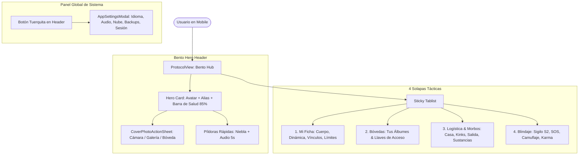

# Technical Design: Profile Bento Hub Architecture

## Architecture Overview

## Component Transformations

1. **`ProtocolView.tsx`**:
   - Reemplaza el Hero estirado por una cuadrícula Bento asimétrica:
     - Izquierda: Avatar brutalista con badge de estado y trigger a Action Sheet.
     - Derecha: Alias editable, edad, micro-barra de completitud del perfil (`perfil al 80%`), y badges de confianza.
     - Inferior: Barra dividida con control directo de Modo Niebla y reproductor/grabador de audio de 5s.
   - 4 Solapas limpias y sin contaminaciones cruzadas.

2. **`CoverPhotoSelectorModal.tsx`**:
   - Transformado en un Bottom Sheet nativo brutalista.
   - Ofrece 3 botones táctiles de 56px de alto:
     - `Tomar Foto`: disparador `capture="user"`.
     - `Subir de la Galería`: selector de archivos con compresión automática a WebP.
     - `Elegir de mis Álbumes`: carrusel/grilla táctil de fotos públicas del usuario con selección en 1 toque.

3. **`BioTab.tsx`**:
   - Eliminación de la sección `PREFERENCIAS DE LA APLICACIÓN`.
   - Agrupación en 4 tarjetas Bento limpias con espaciado consistente (`space-y-4`).
   - Sincronización limpia de `mobility` con `myHostCard.hasPlace`.

4. **`BoundariesTab.tsx`**:
   - Eliminación de `CUENTA & SESIÓN OPERATIVA`, `EXPERIENCIA SENSORIAL` y `ALMACENAMIENTO & SINCRONIZACIÓN`.
   - Mantiene estrictamente:
     - `LocationPrivacySection` (GPS S2, Geohash, Modo Sigilo).
     - `Límites y Despedida sin Drama` (Soft-block / desconexión suave con perfiles específicos).

5. **`LogisticsTab.tsx` & `KinksTab.tsx`**:
   - Actualización de labels a rioplatense 2026.
   - Sincronización bidireccional limpia con `myProfile.mobility`.

6. **`translations.ts`**:
   - Actualización de las cadenas de idioma correspondientes.
