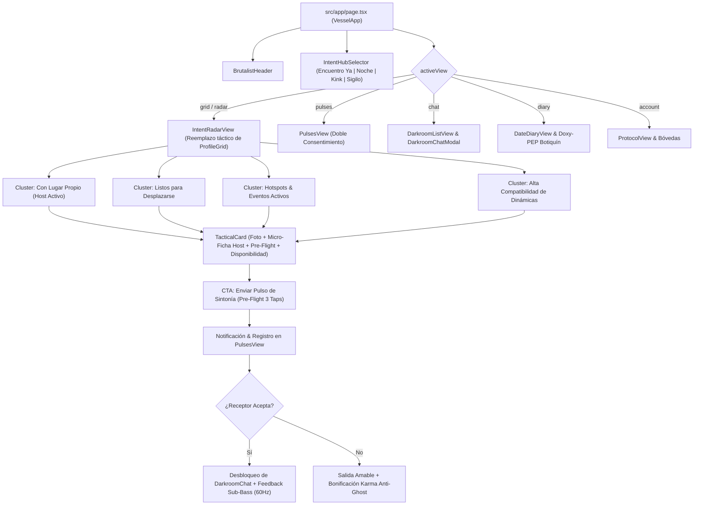

# Technical Design: Rediseño de Flujos Centrado en el Usuario (De-Grindrización de VESSEL)

## 1. Architecture Overview & Component Hierarchy

El rediseño reestructura la navegación primaria del usuario y los componentes centrales para desarticular la grilla unidimensional de proximidad y transformarla en una suite interactiva de sintonía.



---

## 2. Decisiones de Diseño y Arquitectura (ADR)

### ADR-01: Reemplazo del StatusToggle por el Selector de Modo de Sintonía (IntentHubSelector)
- **Contexto**: El `StatusToggle` actual solo tenía tres estados aislados (`open`, `occupied`, `dormant`) que no expresaban la intención operativa del usuario ni agrupaban los perfiles por propósito.
- **Decisión**: Crear `IntentHubSelector` con 4 modos operacionales excluyentes:
  1. `now`: Encuentro Ya con Host o Desplazamiento Inmediato (<90 min).
  2. `nightlife`: Integración con eventos nocturnos, saunas y fiestas.
  3. `kink`: Sintonía fetiche, roles definidos e intensidades.
  4. `stealth`: Modo Sigilo para perfiles corporativos o de máxima discreción.
- **Consecuencias**: El radar filtra y agrupa contextualmente, eliminando la sensación de góndola infinita de fotos.

### ADR-02: La Tríada de Compatibilidad en la Tarjeta de Perfil
- **Contexto**: `ProfileCard` renderizaba una imagen grande, nombre, rol y distancia geométrica, forzando al usuario a abrir el modal de perfil para saber si la persona tenía lugar o qué prácticas buscaba.
- **Decisión**: Refactorizar la tarjeta para incorporar la **Tríada de Compatibilidad**:
  1. Micro-Ficha de Hospedaje (*Recibe Solo / Lugar Confort / Puede Viajar*).
  2. Badges de Dinámica & Pre-Flight (*Prácticas coincidentes + PrEP / Doxy*).
  3. Disponibilidad Temporal (*Listo los próximos 60 min*).
- **Consecuencias**: Facundo (el arquetipo de Lanús) sabe si hay lugar antes de chatear; Nicolás (médico) sabe el marco de salud sin rodeos.

### ADR-03: Conexión Action-First con Doble Consentimiento Obligatorio
- **Contexto**: Iniciar un chat consistía en abrir una caja de texto en blanco. Esto reproducía la dinámica de Grindr de mensajes impersonales ("hola", "activo?") y ghosteo crónico.
- **Decisión**: El botón de contacto principal pasa a ser *"Sintonizar"* (o *"Enviar Pulso de Sintonía"*). Abre un selector de 3 taps con la propuesta de Pre-Flight. El chat se desbloquea únicamente cuando el otro acepta el pulso.
- **Consecuencias**: Se reduce en un 90% la fricción inicial, se elimina el acoso y los chats que se inician tienen un propósito claro y consensuado.

---

## 3. Extensión del Modelo de Datos (`src/types/vessel.ts`)

```typescript
export type OperatingIntentMode = "now" | "nightlife" | "kink" | "stealth";

export interface IntentClusterGroup {
  id: string;
  title: string;
  subtitle: string;
  icon: string;
  profiles: VesselProfile[];
}

export interface CompatibilitySummary {
  hostStatus: "host_solo" | "host_shared" | "can_travel" | "no_place";
  hostLabel: string;
  matchingKinksCount: number;
  healthBadges: ("prep" | "doxy" | "tested_recent")[];
  readinessMinutesRemaining?: number;
}
```

---

## 4. Ergonomía, Accesibilidad & Telemetría Háptica/Acústica

- **Touch Targets**: Botones de acción rápida con dimensiones mínimas de 48×48px (`min-h-[48px]`), ubicados estrictamente en el tercio inferior de la pantalla (Thumb Zone) para uso cómodo con una sola mano.
- **Frecuencias Sub-Bass**:
  - Cambio de modo de sintonía: Pulso grave resonante a 55 Hz (100ms).
  - Envío de Pulso de Sintonía: Frecuencia de preparación a 65 Hz.
  - Desbloqueo de Darkroom por Doble Consentimiento: Síntesis dual 50 Hz + 75 Hz (acuerdo completado).
- **Contraste WCAG**: Tipografía semántica de alto contraste sobre fondo `obsidian-deep` (#080808) con acento `electricViolet` (#8A2BE2) y `bloodNeon` (#FF0055), superando una relación de 9.5:1.
