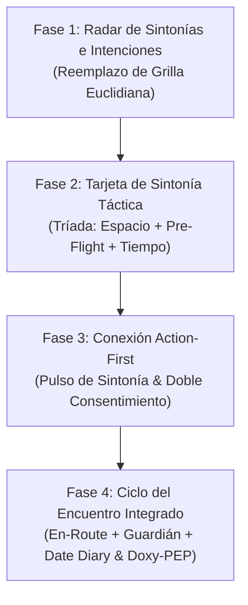

# Proposal: Rediseño de Flujos Centrado en el Usuario (De-Grindrización de VESSEL)

## 1. Intent & Declaración de Propósito

VESSEL nació con una misión clara: **eliminar la pérdida de tiempo, el acoso, los perfiles fantasma y la superficialidad de las aplicaciones tradicionales de encuentros gay/queer**. 

Sin embargo, al mantener la pantalla principal como una grilla infinita de fotos ordenadas por distancia geométrica, la aplicación sigue condicionando al usuario a replicar los hábitos nocivos de Grindr (scrollear fotos como vidriera, iniciar chats vacíos con *"hola qué hacés"*, frustrarse por falta de lugar o coincidencia y terminar en ghosteo).

Esta propuesta establece el **rediseño integral de los flujos de interacción y secciones de VESSEL**, pasando de un modelo de "Catálogo de Cuerpos" a una **"Suite de Sincronización y Encuentro Físico con Propósito"**, poniendo a los 20 arquetipos de usuario en el centro absoluto del diseño.

---

## 2. Alcance (Scope)

### Dentro del Alcance (In Scope)

1. **Fase 1: El Radar de Sintonías (Hub de Intenciones Inmediatas)**:
   - Reemplazar el `StatusToggle` estático y la grilla homogénea por 4 Modos Operativos de Sintonía:
     - ⚡ **"Encuentro Ya" (Live Session)**: Personas con lugar propio o listas para desplazarse en <90 minutos, con ficha de hospedaje explícita.
     - 🍸 **"Radar Nocturno / Hotspots"**: Conexión contextual con fiestas (Crobar, Under Club), saunas, cruising y eventos del día.
     - ⛓️ **"Sintonía Kink & Dinámicas"**: Coincidencias de fetiches, roles y niveles de intensidad sin censura ni ambigüedades.
     - 🛡️ **"Modo Sigilo / Zero-Trace"**: Privacidad facial forzada (Modo Niebla), llaves criptográficas y bloqueo rápido de señuelo.
2. **Fase 2: La Tarjeta de Sintonía (La Tríada de Compatibilidad)**:
   - Rediseño de `ProfileCard` para que la decisión no dependa solo de la foto de torso, mostrando de un vistazo:
     - **Espacio / Hospedaje**: Micro-ficha de hospedaje (Quién recibe, comodidades, discreción).
     - **Dinámica / Rol**: Rol sexual + Kinks clave + Pre-Flight Check en micro-insignias brutalistas.
     - **Disponibilidad & Respeto**: Ventana de tiempo activa + Karma Anti-Ghost verificado.
3. **Fase 3: Flujo de Conexión "Action-First" (Fin del Chat Vacío)**:
   - Modificación del flujo de inicio de contacto: en lugar de abrir una caja de texto vacía propensa al ghosteo, el CTA principal es **"Enviar Pulso de Sintonía" con Pre-Flight adjunto**.
   - El chat privado (`DarkroomChatModal`) solo se activa cuando ambas partes confirman el doble consentimiento de intención.
4. **Fase 4: Integración del Ciclo del Encuentro de Punta a Punta**:
   - Enlace fluido y reactivo entre:
     - **Antes del Encuentro**: Pre-Flight Checklist + Ficha de Hospedaje + Pin de Encuentro efímero.
     - **Durante el Encuentro**: Activación automática del Modo En Camino (`EnRouteTracker`) y el Guardián Silencioso (`SafetyBeacon`) con alarma a 45Hz.
     - **Después del Encuentro**: Cierre amable Anti-Ghost + Registro confidencial en el `Date Diary` (Local-First) + Programación de alerta profiláctica de Doxy-PEP a las 24/72 hs.

### Fuera del Alcance (Out of Scope)

- Modificaciones en la infraestructura de backend o migración a bases de datos relacionales (se mantiene Firebase SDK v12 + Local-First).
- Agregado de dependencias npm externas o frameworks de componentes (se cumple el principio Ponytail: cero librerías nuevas).
- Eliminación de la identidad visual brutalista (`obsidian-deep`, `electricViolet`, `bloodNeon`) o de los efectos acústicos analógicos sub-bass.

---

## 3. Impacto en los 20 Arquetipos de Usuario

| Arquetipo de VESSEL | Dolor Actual con el Paradigma Grindr | Solución con el Nuevo Flujo de VESSEL |
| :--- | :--- | :--- |
| **Facundo (Pibe Fit de Lanús)** | Pierde 30 minutos chateando para descubrir que el otro tampoco tiene lugar, o viaja en tren y lo cancelan en la estación. | Ve la Ficha de Hospedaje de entrada ("Recibe en Palermo, lugar cómodo y discreto") y viaja con el Modo En Camino activo para no esperar en la calle. |
| **Ignacio (Corporativo / Discreción)** | Pánico a que su cara aparezca en una grilla accesible por compañeros de trabajo o clientes. | Opera en modo Sintonía Sigilo con Modo Niebla automático, intercambio ciego de llaves y escape instantáneo señuelo (`CalculatorCoverScreen`). |
| **Nicolás (Médico / Salud Sexual)** | Las apps tradicionales tratan el PrEP, Doxy-PEP y los cuidados como un tabú o un campo de texto ignorado. | El Pre-Flight y el Botiquín Doxy-PEP son parte orgánica del acuerdo de encuentro, registrando citas en el Date Diary local-first sin estigmas. |
| **Santi (Raver Queer) & Maxi (Bartender)** | La grilla por distancia muestra gente durmiendo a las 04:00 AM en vez de quienes están en el mismo boliche o buscando after. | El Modo Radar Nocturno los conecta directamente con eventos activos y hotspots en tiempo real. |
| **Rodrigo (Kink Master) & Ariel (Pareja)** | Grindr censura o satura de perfiles que no comprenden dinámicas BDSM o consensos de pareja abierta. | Sintonía Kink filtra con medidores de intensidad y verificación de mutuo acuerdo antes de habilitar el chat. |

---

## 4. Plan de Implementación por Fases (Roadmap)

### Fase 1: El Radar de Sintonías (Hub de Intenciones Inmediatas)
- [ ] 1.1 Crear el selector de intenciones de cabecera (`IntentHubSelector.tsx`) con los 4 modos (Encuentro Ya, Noche, Kink, Sigilo).
- [ ] 1.2 Refactorizar `ProfileGrid.tsx` para estructurar los perfiles en racimos de disponibilidad real en vez de ordenamiento euclidiano puro.
- [ ] 1.3 Integrar acceso directo a Hotspots nocturnos en el modo Noche sin salir del flujo de radar.

### Fase 2: La Tarjeta de Sintonía Táctica
- [ ] 2.1 Enriquecer `ProfileCard.tsx` con la micro-ficha de hospedaje ("Pone Lugar / Convivencia / Puede Viajar").
- [ ] 2.2 Incorporar badges de sintonía rápida de prácticas y barreras (Pre-Flight Check visible a 1 tap).
- [ ] 2.3 Destacar el estado temporal de disponibilidad inmediata ("Listo los próximos 60 min").

### Fase 3: Conexión Action-First & Doble Consentimiento
- [ ] 3.1 Sustituir el botón de chat en blanco en el perfil por *"Enviar Pulso de Sintonía con Pre-Flight"*.
- [ ] 3.2 Implementar modal de aceptación rápida de sintonía en `PulsesView.tsx` (Double Consent).
- [ ] 3.3 Habilitar el Darkroom Chat únicamente tras la aprobación recíproca de dinámicas.

### Fase 4: Ciclo del Encuentro de Punta a Punta
- [ ] 4.1 Añadir disparador automático de cita agendada que ofrezca activar el Modo En Camino (`EnRouteTracker`).
- [ ] 4.2 Conectar la llegada a destino con la sugerencia de activar el Guardián Silencioso (`SafetyBeacon`).
- [ ] 4.3 Al concluir la cita o cerrarse el Darkroom, ofrecer registro automático en `DateDiaryView` y programar recordatorio de Doxy-PEP a las 24 hs.

---

## 5. Criterios de Éxito y Definition of Done (DoD)

1. **Cero regresiones técnicas**: `npm run typecheck` y `npm run test` pasan al 100% (194/194 tests).
2. **Cero dependencias npm infladas**: Todo implementado con el stack actual (React 19, Tailwind v4, Web Audio API, Context API).
3. **Ergonomía Impeccable**: Todos los controles dentro del Thumb Zone móvil con targets táctiles ≥44×44px y feedback acústico sub-bass.
4. **Validación empírica con los 20 arquetipos**: Cada pantalla y flujo debe superar la prueba de los arquetipos críticos (Facundo, Ignacio, Nicolás, Santi).
